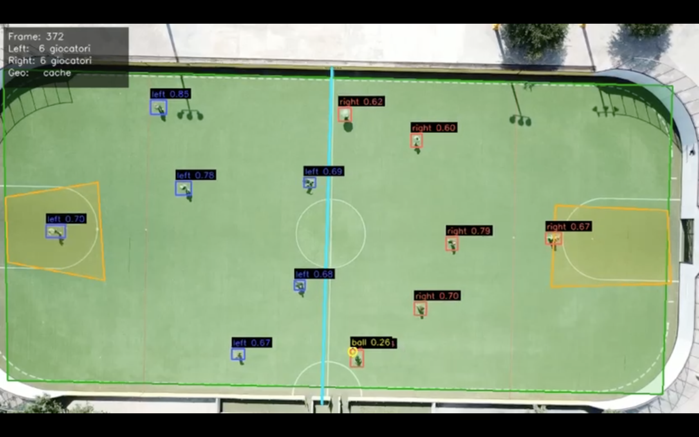

# ⚽ Football Analytics — YOLOv8 Multi-Model Pipeline

Computer vision pipeline for fixed-camera drone footage of football matches. Three specialized YOLOv8 models work together to detect players, the ball, and the field geometry (pitch outline, penalty areas, midfield line), producing fully annotated frames and videos.

**Universidad de Monterrey — Artificial Intelligence II**
Lecturer: Dr. Andrés Hernández Gutiérrez

**Team**
- Camila J. Gonzalez Acosta — #599303
- Mariana Samperio Cuevas — #639835
- Matteo Peroni Pecci — #689789

---

## Overview

| Model | Type | Weights | Dataset format | Task |
|---|---|---|---|---|
| **Player detection** | YOLOv8 | `best.pt` | YOLO 1.1 (CVAT) | `player` bounding boxes |
| **Field pose** | YOLOv8-Pose | `best_pose.pt` | YOLO Pose 1.0 (CVAT), 14 keypoints | Field outline, penalty areas, midfield line |
| **Ball detection** | YOLOv8 (fine-tuned) | `best_ball.pt` | YOLO 1.1 (CVAT), single class | `ball` bounding box (low-confidence threshold) |

The three models are run together on each frame: the field pose model provides geometry that is cached and reused across frames (the drone camera is fixed), while the player and ball models run on every frame. Player bounding boxes are classified as belonging to the left or right side of the pitch based on their position relative to the detected midfield line.

---

## Field Pose — Keypoint Layout

The pose model was trained on a 14-keypoint skeleton, exported from CVAT in YOLO Pose 1.0 format:

```
kpt  1– 4  →  field corners        (TL, TR, BR, BL)
kpt  5– 8  →  left penalty area    (TL, TR, BR, BL)
kpt  9–12  →  right penalty area   (TL, TR, BR, BL)
kpt 13–14  →  midfield line        (TOP, BOTTOM)
```

CVAT exports keypoints with a visibility flag (`x y v`), but YOLO Pose 1.0 expects only `x y`. The pre-processing step strips the visibility value from every label file (47 → 33 columns per row).

---

## Repository Contents

```
.
├── football_analytics_final.ipynb   # Main notebook — full pipeline
├── best.pt                           # Player detection weights (pre-trained)
├── best_pose.pt                      # Field pose weights
├── best_ball.pt                      # Ball detection weights (fine-tuned)
└── README.md
```

---

## Notebook Structure

| # | Section | Notes |
|---|---|---|
| 1 | Setup & imports | Installs `ultralytics`, sets device (GPU/CPU) |
| 2 | Google Drive & paths | Mounts Drive, defines all dataset/weight paths |
| 3 | Player model — load pre-trained weights | ⚡ No training needed, model is ready for inference |
| 4 | Field pose — dataset pre-processing | Strips CVAT visibility flag, generates `data.yaml` |
| 5 | Field pose — training | Transfer learning from `best.pt` backbone |
| 6 | Ball model — dataset pre-processing | Filters `ball` class only, remaps to class 0 |
| 7 | Ball model — fine-tuning | Low LR, frozen backbone layers |
| 8 | Constants, colors & helper functions | Shared rendering/geometry utilities |
| 9 | Sliding window detection | High-res tiling for small-object (ball) detection |
| 10 | Load all 3 models | Single load point for inference |
| 11 | **Inference — single frame** | All 3 models combined, annotated output |
| 12 | **Inference — full video** | Pose geometry cached every N frames |
| 13 | Download results | Annotated frame, video, and (optionally) weights |

---

## Datasets

All datasets were annotated in **CVAT** and exported in YOLO format.

### Player detection (YOLO 1.1)
```
obj_train_data/
├── frame_000001.png
├── frame_000001.txt
├── ...
├── obj.names
└── train.txt
```

### Field pose (YOLO Pose 1.0)
```
dataset_pose/
├── images/train/*.png
├── labels/train/*.txt   # 33 values per row: class cx cy w h + 14×(x y)
├── train.txt
└── data.yaml
```

### Ball detection (YOLO 1.1, single class)
Reuses the player dataset source, filtered to keep only `ball` annotations (remapped to class `0`).

---

## Key Design Decisions

**Transfer learning for the pose model.** The backbone of `best.pt` (already trained on this drone footage for player detection) is transferred into the pose model, excluding only the detection head (`model.22.*`), which has an incompatible output shape. This gives the pose model a strong starting point for the same camera angle and lighting.

**Fine-tuning for the ball model.** Starting from `best.pt`, the ball model is fine-tuned with a low learning rate (`1e-4`) and the first 10 backbone layers frozen, preserving general features while specializing the head for a small, fast-moving target.

**Low confidence threshold for the ball.** The ball occupies very few pixels in 4K drone footage, so its detection threshold (`CONF_BALL = 0.10`) is intentionally lower than the player threshold (`CONF_PLAYER = 0.35`), favoring recall over precision.

**Sliding window detection.** High-resolution frames are split into overlapping 1280×1280 tiles before running the ball model, with global NMS to remove duplicate detections across tile boundaries. This prevents the ball from being resized away on full-frame inference.

**Pose geometry caching.** Since the drone camera is fixed, the field geometry barely changes between frames. The pose model runs only every `POSE_EVERY_N` frames (default 30, ≈1 second at 30 fps), cutting pose inference cost by ~97% with no visible quality loss.

---

## Requirements

```bash
pip install ultralytics
```

Designed to run on **Google Colab** with GPU runtime (T4 or better). Requires Google Drive access for dataset/weight storage.

---

## Usage

1. Open `football_analytics_final.ipynb` in Google Colab.
2. Run sections 1–2 (setup, mount Drive).
3. Run section 3 to load `best.pt` (no training required).
4. Run sections 4–5 to prepare the field dataset and train the pose model (or skip if `best_pose.pt` is already available).
5. Run sections 6–7 to prepare the ball dataset and fine-tune the ball model (or skip if `best_ball.pt` is already available).
6. Run sections 8–10 to load helper functions and all three models.
7. Run section 11 for single-frame inference, or section 12 for full-video inference.
8. Run section 13 to download the annotated results.

---

## Output Examples

- **Single frame**: pitch outline, penalty areas, and midfield line overlaid in semi-transparent polygons; player bounding boxes colored by team side (left/right); ball highlighted with a cyan circle and confidence score.
- **Video**: same annotations applied frame-by-frame, with a HUD panel showing frame index, player counts per side, and geometry cache status.



[Download DEMO RESULT](./result/result_video.mp4)
